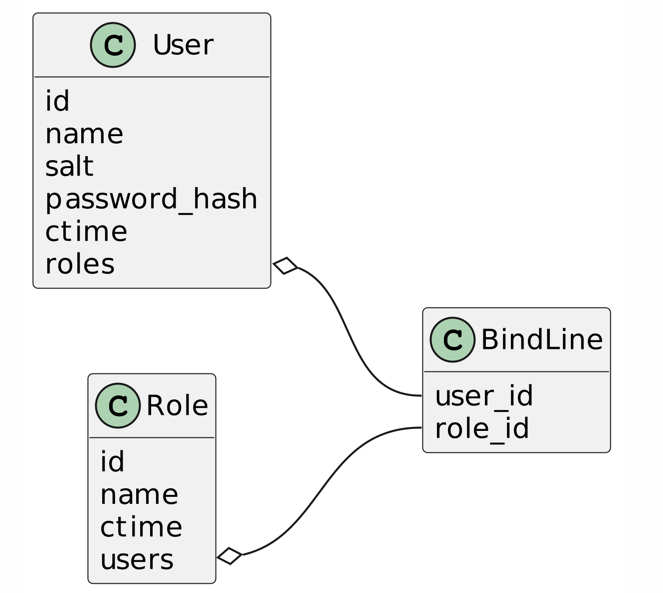
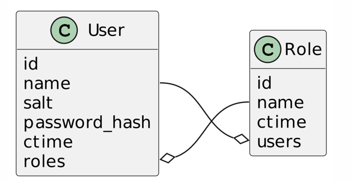

## intro 
auth-demo project, with 2 entities: User, Role. support create user, delete user, etc.

python version: 3.7 or higher

## run in command line

prepare python env

```
virtualenv -p python3 venv
source venv/bin/activate
```

install dep
```
pip install -r requirements.txt
```
run app
```
python run_app.py
# swagger document will auto generated at host:port/docs
# default is localhost:8000/docs
```

run test
```
export TOKEN_EXPIRE_SECONDS=5 # set token expire to 5 seconds to test token expire
pytest tests/unit
pytest tests/integration
pytest tests/e2e
pytest # run all tests
```

## run in pycharm
run run_app.py after prepare the enviroment

## run with docker
```
docker-compose up -d  #start the service
docker-compose exec -e TOKEN_EXPIRE_SECONDS=5 app pytest tests/unit
docker-compose exec -e TOKEN_EXPIRE_SECONDS=5 app pytest tests/integration
docker-compose exec -e TOKEN_EXPIRE_SECONDS=5 app pytest tests/e2e
```

## api
the interface complies with the restful specification

about restful: https://www.jianshu.com/p/b3bd2d4cde62

Compared to requirements documents， the api was converted to complies with the restful specification.
eg:
* Create User - POST /users
* Delete User - Delete /users/{name}

All interfaces are available at http://{host}/docs

## design
According to DDD design philosophy， the project has layer architecture as follows:
* api service: ./auth_demo/app.py
* service layer: ./auth_demo/service_layer/
* domain layer: ./auth_demo/doamin
* repository: ./auth_demo/adapters/repository.py
* external support: ./auth_demo/lib

entities:

in RDBMS， it should have entities and valueobject as follows:


but, with data save in memory， I omit the BindLine, and directly store the reference in an set collection.

And store users to an dict collections with name as key for simple, and store roles in the same way.



Be attention， the User.roles is a set collections and store role with name as hash key,

It was implement by python magic method \_\_eq\_\_ and \_\_hash\_\_,

And Roles.users was implement in the same way.


## Dependencies
* fastapi - web framework
* uvicorn - http server, combined with fastapi to provide http service
* pydantic - used for api param model and response model
* pytest - unit test framework
* requests - used in end to end test for request the api